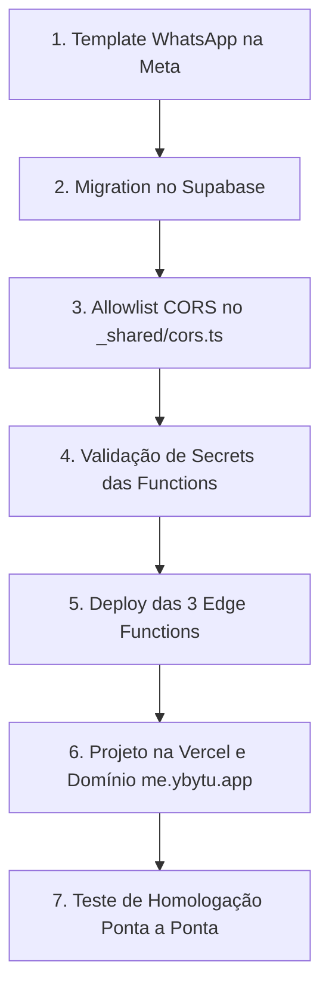

# Guia de Entrada em Produção — Etapa 1: App do Usuário (PWA Ybytu)

Este documento descreve a **ordem exata**, os **requisitos de infraestrutura** e o **roteiro de teste ponta a ponta** para colocar no ar o aplicativo PWA dos usuários (alunos) do Ybytu em `me.ybytu.app`.

---

## 1. Visão Geral da Arquitetura

- **Frontend (PWA)**: React + Vite localizado em [`apps/ybytu-user-pwa`](file:///c:/ybytu/apps/ybytu-user-pwa).
  - Deploy independente na Vercel no subdomínio `me.ybytu.app`.
  - Service Worker com cache offline de assets essenciais.
  - Sincronização automática de tokens de design e regras de mídia com o Dashboard via script [`scripts/check-user-pwa-sync.mjs`](file:///c:/ybytu/scripts/check-user-pwa-sync.mjs).
- **Backend (Supabase Edge Functions)**:
  - [`ybytu-auth-request-otp`](file:///c:/ybytu/supabase/functions/ybytu-auth-request-otp/index.ts): Emissão de código OTP de 6 dígitos via WhatsApp (com fallback por e-mail via Resend), rate limits e resposta cega anti-enumeração.
  - [`ybytu-auth-verify-otp`](file:///c:/ybytu/supabase/functions/ybytu-auth-verify-otp/index.ts): Validação de código com teto de 5 tentativas, invalidação imediata e sessão de 30 dias com Supabase Auth efêmero.
  - [`ybytu-get-user-plan`](file:///c:/ybytu/supabase/functions/ybytu-get-user-plan/index.ts): Entrega o plano ativo chamando `buildPlanPayload.ts` intacto, calculando o início do dia no fuso horário do usuário via query parameter `?timezone=...` e anexando as atividades de hoje.
- **Banco de Dados**:
  - Migration [`supabase/migrations/20260925170000_user_app_checkin_and_otps.sql`](file:///c:/ybytu/supabase/migrations/20260925170000_user_app_checkin_and_otps.sql).

---

## 2. Ordem Exata de Deploy e Configuração

Execute rigorosamente nesta sequência:



### Passo 1: Aprovar Template na Meta (WhatsApp Cloud API)
Antes de disparar mensagens de produção, o template precisa estar aprovado no painel da Meta for Developers:
- **Nome do template**: `ybytu_auth_otp`
- **Categoria**: `AUTHENTICATION` (ou `UTILITY`)
- **Idioma**: `pt_BR`
- **Corpo do texto**:
  ```text
  Seu código de acesso ao Ybytu é {{1}}. Ele é válido por 5 minutos. Não compartilhe este código com ninguém.
  ```
- **Botão (opcional, recomendado)**: Botão de ação rápida `Copiar código` com o parâmetro `{{1}}`.

---

### Passo 2: Aplicar Migration no Supabase
O agente responsável por deploys de banco deve executar a migration:
- **Arquivo**: [`supabase/migrations/20260925170000_user_app_checkin_and_otps.sql`](file:///c:/ybytu/supabase/migrations/20260925170000_user_app_checkin_and_otps.sql)
- **Comando**:
  ```bash
  supabase db push
  ```
  *(ou executar o conteúdo SQL diretamente no SQL Editor do painel do Supabase)*.
- **O que este passo cria/altera**:
  1. Adiciona colunas `training_plan_id`, `day_number`, `session_name` em `completed_workouts` + políticas RLS (`completed_workouts_user_select`, `completed_workouts_user_insert`).
  2. Adiciona colunas `meal_plan_id`, `day_order`, `meal_order`, `meal_name` em `completed_meals` + políticas RLS (`completed_meals_user_select`, `completed_meals_user_insert`).
  3. Cria tabela `auth_otps` com índice único parcial anti-colisão `auth_otps_single_active_code_idx` para solicitações simultâneas.
  4. Agenda rotina diária no `pg_cron` (`cleanup_auth_otps_daily`) às 03:00 UTC para expurgar registros com mais de 7 dias (conformidade LGPD).
  5. Cria função helper `public.find_user_by_identifier` (SECURITY DEFINER) para busca direta e exata por telefone ou e-mail, impedindo a criação indevida de contas via `generateLink` e eliminando varreduras de tabelas em memória.

---

### Passo 3: Adicionar Domínio em `_shared/cors.ts` (Outro Agente)
O outro agente deve acrescentar a origem oficial do PWA na allowlist:
- **Arquivo**: [`supabase/functions/_shared/cors.ts`](file:///c:/ybytu/supabase/functions/_shared/cors.ts)
- **Alteração**:
  ```typescript
  const ALLOWED_ORIGINS = [
    'https://ybytu.app',
    'https://www.ybytu.app',
    'https://pro.ybytu.app',
    'https://dashboard.ybytu.app',
    'https://me.ybytu.app', // <-- ADICIONAR ESTA LINHA
  ]
  ```
  *(Nota: não é necessário mexer em `Access-Control-Allow-Headers`, pois o fuso é enviado via query parameter `?timezone=...`)*.

---

### Passo 4: Verificar Secrets no Supabase
Garantir que as variáveis de ambiente necessárias estejam configuradas no Supabase:
- `SUPABASE_URL`: URL do projeto Supabase.
- `SUPABASE_SERVICE_ROLE_KEY`: Chave service_role (usada para operações admin nas functions).
- `WHATSAPP_TOKEN`: Token de acesso permanente do WhatsApp Cloud API.
- `WHATSAPP_PHONE_NUMBER_ID`: ID do número remetente oficial do Ybytu.
- `RESEND_API_KEY`: Chave da API Resend (usada para envio do e-mail de contingência).
- `ENVIRONMENT`: Deve ser `production` em produção (ou ausente). **Nunca** configurar como `development` em ambiente produtivo, pois isso liberaria chamadas de `localhost`.

---

### Passo 5: Fazer Deploy das 3 Edge Functions
No terminal com a CLI do Supabase autenticada:
```bash
supabase functions deploy ybytu-auth-request-otp
supabase functions deploy ybytu-auth-verify-otp
supabase functions deploy ybytu-get-user-plan
```

---

### Passo 6: Configurar Projeto na Vercel e Domínio
1. No painel da Vercel:
   - Clicar em **Add New Project** e selecionar o repositório `taichella/ybytu`.
   - **Framework Preset**: `Vite`.
   - **Root Directory**: `apps/ybytu-user-pwa`.
   - **Build Command**: `npm run build`.
   - **Output Directory**: `dist`.
2. **Environment Variables**:
   - `VITE_SUPABASE_URL`: URL da instância Supabase de produção.
   - `VITE_SUPABASE_ANON_KEY`: Chave anônima pública (anon key) do Supabase.
3. **Domínio**:
   - Em **Settings > Domains**, adicionar `me.ybytu.app`.
   - Configurar o registro CNAME no DNS correspondente apontando para `cname.vercel-dns.com`.

---

## 3. Roteiro de Teste Ponta a Ponta com Usuário Real

Siga este passo a passo utilizando um perfil de aluno cadastrado na base com plano de treino e plano alimentar ativos.

### Teste 1: Solicitação do Código OTP (WhatsApp)
1. Acesse `https://me.ybytu.app` no navegador do celular (ou desktop com DevTools simulando 375px).
2. **O que deve aparecer**: A tela de login com o logotipo Ybytu, título "Acessar sua Conta", campo de WhatsApp pré-formatado e botão "Receber código no WhatsApp".
3. Digite o número de WhatsApp do usuário com DDD (ex: `11987654321`) e clique no botão.
4. **O que observar na tela**:
   - O botão exibe "Enviando código…".
   - A tela muda para a etapa de verificação de 6 dígitos.
   - Mensagem: "Enviado para (11) 98765-4321".
   - Contador de expiração em contagem regressiva a partir de 05:00.
   - Botão de reenvio com cooldown de 60 segundos.
5. **O que conferir no Banco de Dados**:
   ```sql
   SELECT id, identifier, identifier_found, attempts, is_used, expires_at, created_at 
   FROM public.auth_otps 
   WHERE identifier = '+5511987654321' 
   ORDER BY created_at DESC 
   LIMIT 1;
   ```
   - `identifier_found` deve ser `true`.
   - `is_used` deve ser `false`.
   - `attempts` deve ser `0`.
   - `code_hash` deve conter um hash SHA-256 de 64 caracteres.

---

### Teste 2: Contingência — E se o WhatsApp NÃO chegar?
Se a entrega pelo WhatsApp falhar ou o usuário não tiver o número em mãos:
1. **Fallback Automático**: Se a API da Meta retornar erro ou timeout, a function responde de forma amigável e o app exibe: *"Não foi possível entregar o código pelo WhatsApp. Experimente solicitar por e-mail."*
2. **Fallback Manual na Tela**:
   - Na tela de login, clique no link *"Não tem WhatsApp? Entrar por e-mail"*.
   - Digite o e-mail cadastrado do usuário e clique em *"Receber código por e-mail"*.
   - Verifique a caixa de entrada (e spam) do e-mail.
3. **Canal Humano de Suporte**:
   - No rodapé de ambas as etapas há o link: *"Falar com suporte no WhatsApp →"*.
   - Ao clicar, abre o WhatsApp oficial de suporte (`5511955026812`) com mensagem pré-preenchida para resolução manual pelo staff.

---

### Teste 3: Validação do Código e Entrada
1. Digite o código de 6 dígitos recebido. Ao preencher o sexto dígito, a validação dispara automaticamente.
2. **O que observar na tela**:
   - Exibe "Validando…".
   - Redireciona imediatamente para `https://me.ybytu.app/hoje`.
3. **O que conferir no Banco de Dados**:
   ```sql
   SELECT id, is_used, attempts 
   FROM public.auth_otps 
   WHERE identifier = '+5511987654321' 
   ORDER BY created_at DESC 
   LIMIT 1;
   ```
   - `is_used` agora deve ser `true` (código queimado imediatamente).
4. **O que conferir no Navegador**:
   - No `localStorage`, a chave `sb-<ref>-auth-token` foi gravada com a sessão JWT oficial emitida pelo Supabase Auth.

---

### Teste 4: Visualização do Plano e Mídia (/hoje)
1. **Header**:
   - Exibe saudação com o primeiro nome do aluno: *"Olá, [Nome]!"*.
   - Data atual formatada (ex: *"seg., 28 de set."*).
   - Botão de logout no canto superior direito.
2. **Aba Treino**:
   - Seletor de dias do split (se houver mais de 1 dia cadastrado).
   - Card resumo da sessão com minutos estimados, contagem de exercícios e alertas de cautela.
   - Lista de exercícios:
     - Cada exercício possui miniatura com carregamento imediato (otimizada via Cloudflare R2).
     - Informações de séries, repetições e carga (formatada corretamente: carga numérica em kg, "Peso corporal", "Elástico" ou "Carga a definir" — nunca exibe 0 kg).
   - Clique no ícone de **Play** do exercício:
     - Abre o modal em tela cheia com reprodução do vídeo do exercício hospedado no R2.
     - Fechamento via botão "X", clique fora ou tecla `Esc`.
3. **Aba Alimentação**:
   - Alterne para a aba *"🥗 Alimentação"*.
   - Metas diárias de calorias e macronutrientes (proteína, carboidrato e gordura).
   - Lista das refeições ordenadas com horários sugeridos e quantidades exatas dos alimentos.

---

### Teste 5: Check-in de Treino e Refeição
1. **Check-in do Treino**:
   - Na aba Treino, clique no botão *"Concluir Treino de Hoje"*.
   - **O que olhar na tela**: O botão transita para estado verde de sucesso: *"✓ Treino concluído hoje às HH:MM!"*.
   - **O que conferir no Banco de Dados**:
     ```sql
     SELECT id, user_id, training_plan_id, day_number, session_name, completed_at 
     FROM public.completed_workouts 
     WHERE user_id = '<USER_ID>' 
     ORDER BY completed_at DESC 
     LIMIT 1;
     ```
     - Linha gravada com o ID estável do plano, o ordinal do dia e a data/hora em UTC.
2. **Check-in de Refeição**:
   - Na aba Alimentação, localize uma das refeições e clique em *"Marcar como realizada"*.
   - **O que olhar na tela**: O botão se transforma em etiqueta verde: *"✓ Refeição feita às HH:MM"*.
   - **O que conferir no Banco de Dados**:
     ```sql
     SELECT id, user_id, meal_plan_id, day_order, meal_order, meal_name, completed_at 
     FROM public.completed_meals 
     WHERE user_id = '<USER_ID>' 
     ORDER BY completed_at DESC 
     LIMIT 1;
     ```
     - Linha gravada com `day_order`, `meal_order` e nome da refeição.

---

### Teste 6: Persistência após Reload e Fuso Horário
1. Recarregue a página no navegador (F5 / Puxe para atualizar no celular).
2. **O que deve acontecer**:
   - O usuário **não** é deslogado.
   - O plano carrega de imediato.
   - O treino e a refeição marcados permanecem exibidos como concluídos com o horário correspondente.
   - A function calculou o início do dia a partir de `00:00:00` no fuso enviado na query (`America/Sao_Paulo`), garantindo que o check-in feito às 21h ou 23h de Brasília continue contabilizado como hoje.

---

### Teste 7: Aluno Bloqueado (Sem Plano Pronto)
1. Para validar o comportamento de contingência quando o aluno acabou de entrar e ainda não teve o plano aprovado:
   - Faça login com um usuário sem plano ativo no banco.
2. **O que olhar na tela**:
   - Redireciona automaticamente para `https://me.ybytu.app/bloqueio`.
   - Exibe a mensagem amigável: *"Plano em Preparação — A equipe pro de treinadores e nutricionistas está finalizando o planejamento individualizado da sua rotina..."*.
   - Botão direto para falar com o suporte no WhatsApp e botão *"Verificar se o plano já está pronto"*.

---

### Teste 8: Encerramento de Sessão (Logout)
1. Clique no botão de logout (ícone de saída) no canto superior direito do header.
2. **O que observar**:
   - Sessão é desfeita no Supabase Client local.
   - O usuário é redirecionado para a tela `/login`.
   - Se o usuário tentar acessar `/hoje` manualmente pela barra de endereço, o app redireciona imediatamente de volta para `/login`.
